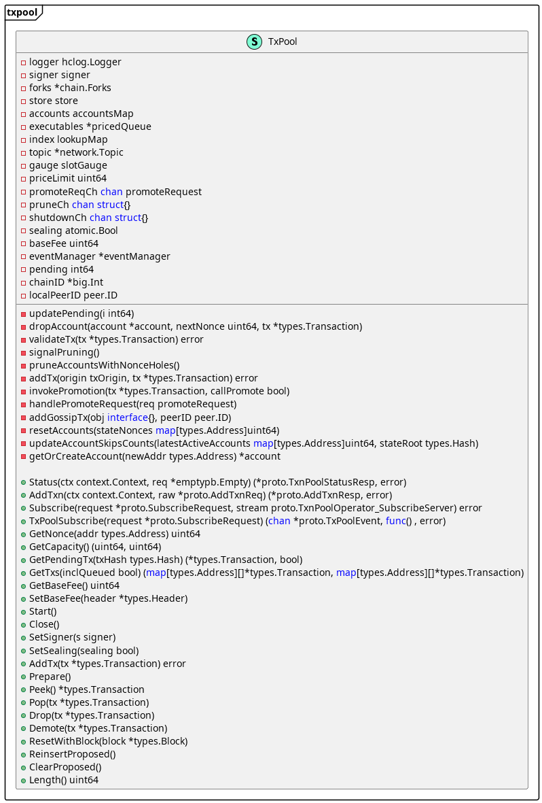
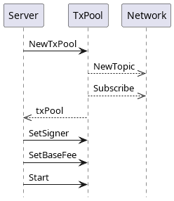

# Transaction Pool

The **`TxPool`** module is an in-memory structure that manages the incoming transactions for processing. It maintains a list of unprocessed transactions and ensures they conform to specific constraints before entering the pool.

## Model 

Details of **`TxPool`** structure are shown in the TxPool Structure diagram.

<figure><figcaption>
TxPool Structure
</figcaption></figure>

TxPool fields:

* **`logger`** - logger interface that defines applicable logger methods,
* **`signer`** _-_ signer interface that defines a transaction sender,&#x20;
* **`forks`** - map which contains all forks and their starting blocks from genesis,
* **`store`** _-_ interface defines State helper methods the TxPool should have access to,
* **`accounts`** - map of all accounts registered by the pool,
* **`executables` **_**-**_ all the primaries (transactions ready for execution) sorted by max gas price,
* **`index`** - lookup map keeping track of all  transactions present in the pool,
* **`topic`** - networking stack,
* **`gauge`** - gauge for measuring pool capacity,
* **`priceLimit`** - priceLimit is a lower threshold for gas price,
* **`sealing`** - flag indicating if the current node is a sealer (validator), and should therefore gossip transactions,
* **`baseFee`** - baseFee is the base fee of the current head.  This is needed to sort transactions by price,
* **`eventManager`** - event manager for txpool events,
* **`pending`** - pending is the list of pending and ready transactions. This variable is accessed with atomics,
* **`chainID`** - chain id,
* **`localPeerID`** - localPeerID is the peer ID of the local node that is running the TxPool.

Some of the main TxPool functions include:

* **`NewTxPool` **_**-**_ NewTxPool creates and returns a new pool for processing incoming transactions,
* **`Start`** _-_ runs the pool's main loop in the background.  On each request received, the appropriate handler is invoked in a separate goroutine,
* **`Close` **_**-**_ shuts down the pool's main loop,
* **`SetSigner`** - sets the signer the pool will use // to validate a transaction's signature,
* **`AddTx` **_**-**_ adds a new transaction to the pool (sent from json-RPC/gRPC endpoints) and broadcasts it to the network (if enabled),
* **`Prepare`** - generates all the transactions ready for execution. (primaries),
* **`Peek` **_**-**_ returns the best-price selected transaction ready for execution,
* **`Pop` **_**-**_ removes the given transaction from the associated promoted queue (account). It  will update executables with the next primary from that account (if any),
* **`Drop` **_**-**_ clears the entire account associated with the given transaction and reverts its next (expected) nonce,
* **`Demote` **_**-**_ excludes an account from being further processed during block building due to a recoverable error. If an account has been demoted too many times, it is Dropped instead,
* **`ResetWithBlock`** _-_ processes the transactions from the newly finalized block to sync the pool with the new state,
* **`ReinsertProposed` **_**-**_ returns all transactions from the accounts proposed queue to the promoted queue. It is called from consensus algorithm, when new round > 0 starts or when current sequence is cancelled.
* **`ClearProposed`** _-_ clears accounts proposed queue when round 0 starts. It is called from consensus algorithm.

## TxPool Instantiation 

Every node has a single instance of `TxPool` in-memory structure, which is created on the node startup. `NewTxPool` method is in charge of creating a new `TxPool` populated with static and dynamic content. Afterwards, transaction `TxPool`'s signer is created and assigned, base fee is determined and assigned, and TxPool is started. `TxPool` listens for a shutdown event, prunes accounts with nonce holes and handles promoted transactions.

<figure><figcaption></figcaption></figure>

### Block Creation 

`BlockBuilder`'s `Fill` method uses `TxPool` to fill the block with transactions taken from`TxPool`. Each transaction is validated one by one, and valid transactions are added to the`BlockBuilder`'s list of transactions. Transactions are validated until a predefined timer (for block creation) expires or a predefined gas (for prepared transactions) is spent.

_Block Creation Sequence Diagram_ gives a detailed overview of block creation actions. `BlockBuilder`'s is in charge of&#x20;

* creating a block timer that limits the time interval allowed for block creation, and
* preparing transactions in TxPool,  where all transactions ready for execution are sorted descending by best price (i.e., transaction fee), giving an advantage to more expensive ones.

After the block timer is set and transactions are prepared, transactions are taken from the TxPool and checked for their validity during the transaction write process. The process adds a valid transaction to the block and removes it from the TXPool.&#x20;

If the transaction is invalid, then, depending on the error, the transaction is dropped or demoted from the TxPool. A dropped transaction assumes that its entire account is cleared and its nonce is reverted, while a demoted transaction assumes that its account is excluded from further processing during block building due to a recoverable error. Still, if an account is demoted too many times, it will be dropped instead.&#x20;

If the gas limit is reached, the block creation is finished. Otherwise, the process is repeated with the next transaction from the TxPool until the predefined time expires.

<figure><figcaption>
Block Creation Sequence Diagram
</figcaption></figure>

### 1.4 Dodavanje transakcija u txPool 

Do sad smo opisali proces generisanja/instanciranje txpool strukture i njegovu upotrebu/ulogu tokom gradjenja bloka, a u ovom delu opisaćemo način kako se txpool dopunjuje sa potencijalnim transakcijama.

Txpool komponenta bogati se sa novim transakcijama uglavnom preko JsonRPC komponente. JsonRPC komponenta odnosno protokol je namenjen za komunikaciju cvora sa spoljnim svetom. JosnRPS komunikacija se zasniva na json porukama… TxPool dobija nove transakcije pozivom metode _**SendRawTransaction**_ sa spoljnog sveta preko jsonRPC komponente. U okviru ove metode poziva se metoda AddTx sa txpool komponente. U okviru AddTx metode prvo se vrši validiranje pristigle transakcije. U slučaju da transakcija nije validna vraća se error poruka i transakcija se ne dodaje u listu potencijalanih. Neke od validacija su:

* _**StateTxPType**_ transakcije nije ocekivan da se dodeli u txpool,
* Veličina transakcije ne sme da bude veća od 128 kB, ovim se stitimo od DOS napada,
* Vrednost transakcije mora biti pozitivna,
* Transakcija mora biti pravilno potpisana, pošaljilac treba da može da se izdvoji,
* Atribut _**from**_ od transakcije, ako je popunjeno, mora da se poklapa sa potpisnikom,
* ako atribut _**from**_ nije popunjeno popuni se sa potpisnikom,
* _**AccessListTxType**_ može se primeniti samo ako je u bloku aktivan Berlin hardfork (tj. EIP-2930), i ako nije podcenjena,
* _**DinamicFeeTxType**_ može se primeniti samo ako je u bloku forkovan London hardfork, dok polja _**feeCap**_ i _**tipCap**_ moraju postoja i biti tačna, transakcija ne sme biti potcenjena,
* U slučaju lodonskog hardforka transakcije ne smeju biti potcenjene,
* Index transakcije ne sme biti manji od indeksa iz accounta,
* Pošaljilac transakcije mora da ima dovoljno novca za izvršenje transakcije,
* Transakcija mora imati više gasa nego što je potrebno za naknadu za izvršenje transakcije,
* Gas limit za poslednji blok ne sme biti manji od gasa transakcije.

Ako prethodne validacije nisu ispunjene vraća se odgovarajuća error poruka, a ako su ispunjene slede akcije po navedenom redu:

* Kalkulacija Hash-a za samu transakciju,
* Dodavanje accounta u txpool mapu ako nije već u njoj
* Proverava se indeks transakcije da li je ocekivan u odnosu na account index (nonce), ako nije odbija se transakcija,
* Ako index transakcije već postoji u accountu i ako postojeca transakcija iz accounta ima istu i bolju cenu transakcija se odbija,
* Ako postojeća transakcija ima isti hash kao novododatao, transakcija se odbija
* Ako u okviru accounta imamo dostignut maksimalan broj transakcija u redu i index transakcije nije index accounta transakcija se odbija,
* Index transakcije ne sme biti manji od indeksa accounta
* Zamena postojece transakcije se sastoji od proovera mogucnosti korekcija slota koji zauzima nova transakcija, ukoliko korekcije prvazilazi maksimum transakcija se odbija,
* Dodavanje transakcije u _**lookup mapu**_ i uklanjanje prethodne transakcije sa istim indeksom (ako je postojala),
* Sledi dodavanje transakcije u red cekanja ili zamena postojece transakcije iz reda čekanja,
* Bacanje eventa da je dodata transakcija u txpool
* Nakon ovog sledi publish transakcija kroz mreu na druge nodove (ako node ima mogućnost da salje transakcije kroz mrežu), Drugi nodovi su pretplaceni na ove transakcije kroz metodu addGossipTx kroz koju dodaju kod sebe transakciju za u txpoool.

<figure><figcaption></figcaption></figure>
