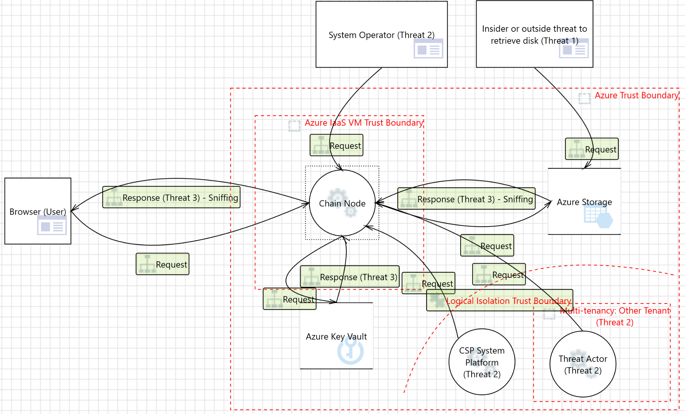

# Considerations

### Context

This chapter is dedicated to outlining a comprehensive strategy for ensuring data security within the Blade chain for multiple cloud providers. The primary objective is to implement measures facilitating the smooth deployment of Blade across different vendors, thereby mitigating the risk of vendor lock-in. The chapter aims to articulate the necessary steps for adopting a cloud-first Secure by Design approach.

As the focus is on **confidentiality**, the discussion delves into three key aspects of encryption within Blade data protection framework:

1. Data at rest encryption
2. Data in transit encryption
3. Data in use encryption

It is essential to discern the primary focus of each encryption aspect across different scenarios. To achieve this, a **risk-based methodology** is presented, along with tailored response strategies for identified threats.

To elaborate further, the chapter addresses the following specific areas:

* Encryption protocols relevant to Infrastructure as a Service (IaaS) and general compute environments (e.g., Azure Virtual Machine, AWS EC2, and GCP Compute Engine), including virtual disks.
* Implementation of the gRPC framework to ensure secure communication, with a particular emphasis on encryption in transit.
* Encryption measures for RPC via HTTPS requests originating from the computational environment.
* Secure management of keys that involves implementing robust protocols, strict access controls, and secure storage solutions such as Key Vaults or Hardware Security Modules (HSMs).

### Preconditions and Inputs

To ensure data protection of Blade, it is necessary to execute the following steps:

1. Data classification / Inventory
2. Regulations, requirements, and industry best practices
3. Design reviews and threat modeling
4. Establishing Data Protection processes

**Data classification** tags data according to its type, sensitivity, and value to the organization if altered, stolen, or destroyed. It helps an organization understand the value of its data, determine whether the data is at risk, and implement controls to mitigate risks. As a first step, it’s necessary to define different data categories and describe them. Some sensitive data like keys, secrets, and other authentication identifiers are clearly sensitive data, but when it comes to business-critical data and PII (personally identifiable information), the data classification needs special focus and attention.

**Requirements** are sourced from applicable laws, executive orders, directives, regulations, policies, standards, procedures, or mission/business needs to ensure the confidentiality, integrity, and availability of information that is being processed, stored, or transmitted. ([definition](http://csrc.nist.gov/glossary/term/security\_requirement)). However, it is of utmost importance to perform proper **threat modeling** to elicit additional requirements in the context of the software design that will lead to proper design reviews ensuring Secure by Design is a driving principle from initial stages of software development.

**Data protection processes** are methods and practices to safeguard personal data from unauthorized or unlawful access, use, disclosure, alteration, or destruction. The processes need to be established to ensure software vendor’s alignment with regulations and laws.

### Data Classification 

The following table presents an overview of sensitive data types handled by the system. P1 is designated for highly sensitive data, P2 for sensitive data, and P3 for all other business critical data. This classification system helps prioritize the protection of different types of data based on their sensitivity and criticality.

Understanding and categorizing the types of sensitive data is crucial for maintaining data security and compliance with relevant regulations. By clearly defining the nature of the data handled by the system, appropriate safeguards and controls to protect the confidentiality and integrity of this information can be established. Furthermore, a privacy policy can be developed.

<table data-header-hidden><thead><tr><th width="47"></th><th width="103"></th><th width="138"></th><th></th></tr></thead><tbody><tr><td><strong>#</strong></td><td><strong>Category</strong></td><td><strong>Subcategory</strong></td><td><strong>Description</strong></td></tr><tr><td>1</td><td>P1</td><td>Login information</td><td>Credentials used to access a system or platform. If revealed, such data can lead to unauthorized access, data breaches, and potential system compromise.</td></tr><tr><td>2</td><td>P1</td><td>Financial Data</td><td>Public wallet addresses and the associated transactional data. If revealed, such data can potentially expose sensitive financial information.</td></tr><tr><td>3</td><td>P2</td><td>Tracking</td><td>IP address, browser fingerprint and session ids. However, these data used within the system cannot be directly linked to some individual. If revealed, there is the risk of malicious attacks targeting an individual's device or network in general. Also, it may lead to targeted identity theft efforts.</td></tr><tr><td>4</td><td>P2</td><td>Social</td><td>Connections, usual exchanges between accounts and similar activities among public wallet addresses and their analysis. If revealed, such data may lead to exploitation of personal connections, and potential manipulation or misuse of individuals' relationships and activities</td></tr></tbody></table>

The system **does NOT** handle highly sensitive data pertaining to race, ethnicity, political affiliations, biometrics/genetics, health conditions, sexual orientation, criminal offenses, private communications, personal diaries, precise location data, or national unique identifiers.

### Risk based methodology

From an attacker perspective, it is important to understand that data is typically the end goal of the attacker to deliver the impact of the attack. Per MITRE ATT\&CK framework (see [here](https://attack.mitre.org/matrices/enterprise/)), exfiltration (see [here](https://attack.mitre.org/tactics/TA0010/)) deserved a separate category. However, turning to the STRIDE framework and focusing on Information Disclosure, we can focus on the virtual machines hosting App chain nodes and the communication among these nodes to identify and narrow down the threats requiring mitigation during the operation of Blade.

#### **Threat 1** - Sensitive data in the VM can be disclosed if the OS or the file system in the virtual machine is not encrypted

This threat is mitigated through common mitigation strategies, which involve encrypting disks utilized by virtual machines. These strategies leverage configurations supported by all major cloud vendors. Typically, they rely on standard mechanisms built for different operating system versions – BitLocker for Windows OS family and DM-Crypt technology for UNIX based OS family.

It is important to ensure the encryption keys are stored properly and careful consideration regarding the entity responsible for generating these keys is crucial. More about proper key management can be found in the Key Vaults section of this document.

**The recommendation:** Today, full disk encryption is expected practice to ensure **data at rest** encryption and it should be done in almost all cases when using public cloud resources.

\[More information – Azure]: [Sensitive Data - Microsoft Threat Modeling Tool - Azure | Microsoft Learn](https://learn.microsoft.com/en-gb/azure/security/develop/threat-modeling-tool-sensitive-data#disk-vm)

\[Configuration – Azure]: [Azure Disk Encryption scenarios on Windows VMs](https://learn.microsoft.com/en-us/azure/virtual-machines/windows/disk-encryption-windows)

\[Configuration – AWS]: [Encryption best practices](https://docs.aws.amazon.com/prescriptive-guidance/latest/encryption-best-practices/services-best-practices.html) and specifically, for [VMs.](https://docs.aws.amazon.com/prescriptive-guidance/latest/encryption-best-practices/ec2-ebs.html)

\[Configuration – GCP]: [Encrypt disks with customer-supplied encryption keys](https://cloud.google.com/compute/docs/disks/customer-supplied-encryption)

**Blade mitigation:** In the deployment phase of the Blade chain, the configuration for instantiating VMs that host Blade nodes is tailored based on the selected cloud provider. This configuration is specifically designed to activate disk encryption. The combined effect of this applied configuration and the cloud provider's capability to encrypt disks ensures comprehensive protection for sensitive data within Blade.

#### **Threat 2 –** Sensitive data can be accessed without customers consent by a vulnerability in CSP platform or it could include a malicious system operator

The concept of confidential computing protects the data from cloud system software vulnerabilities preventing even other tenants from exploiting other tenants' data, cloud operators, and with the concepts of enclaves, it protects the data from software operators as well. It achieves these goals by relying on TEE (Trusted Execution Environment) supported by new hardware technologies where processors separate different execution areas segregating the data and application code from the OS context. The encryption keys are stored within the processor chips themselves. We may say that this mitigation strategy relies on **data at rest and data in use** encryption.

All sensitive workloads should explore the option of using TEE virtual machines for elevated data protection.

Trusted computing also has a use case for enterprise blockchains as it enables preserving confidentiality of blockchain data (see [here](https://www.intel.com/content/dam/www/public/us/en/documents/solution-briefs/intro-to-confidential-computing-solution-brief.pdf)) by ensuring only authorized parties can see the data and transaction happening on the permissioned blockchain network.

**The recommendation:** If the target application works with sensitive data or has high-risk profile data and is being considered for public cloud deployment, trusted VMs and in general, confidential computing services fall under a **must requirement** category.

\[More information – Azure]: [Confidential Computing – Protect Data In Use | Microsoft Azure](https://azure.microsoft.com/en-us/solutions/confidential-compute)

\[Configuration – Azure VM]: [About Azure confidential VMs](https://learn.microsoft.com/en-us/azure/confidential-computing/confidential-vm-overview)

\[More information – AWS]: [Confidential computing: an AWS perspective](https://aws.amazon.com/blogs/security/confidential-computing-an-aws-perspective/)

\[Configuration – AWS VMs (EC2)]: Today, memory encryption is enabled by default on all [Graviton2-based instances](https://aws.amazon.com/ec2/graviton/) (T4g, M6g, C6g, C6gn, R6g, X2g), and Intel-based [M6i instances](https://aws.amazon.com/blogs/aws/new-amazon-ec2-m6i-instances-powered-by-the-latest-generation-intel-xeon-scalable-processors/), which have Total Memory Encryption (TME).

\[More information – GCP]: [Introducing Google Cloud Confidential Computing](https://cloud.google.com/blog/products/identity-security/introducing-google-cloud-confidential-computing-with-confidential-vms)

\[Configuration – GCP]: From the link above: all GCP workloads you run in VMs today can run as a Confidential VM. One checkbox - it’s that simple.

**Blade mitigation:** During the deployment phase of the Blade chain, Trusted Execution Environment (TEE) virtual machines serve as the foundational hosts for the nodes. This strategic choice reflects a deliberate architectural decision aimed at providing the security and reliability of Blade infrastructure. By leveraging TEE virtual machines, Blade ensures a heightened level of trustworthiness in its node hosting environment. TEE technology provides a secure execution environment that safeguards critical operations and data within isolated enclaves, protecting against unauthorized access and tampering attempts.

#### Threat 3 - Sensitive data can be sniffed through unencrypted traffic

TLS is a protocol that encrypts data in transit between App chain nodes. This encryption ensures that sensitive information is protected from interception and unauthorized access. To implement TLS, one must rely on a TLS certificate from a reliable certificate authority (CA) which usually comes in the form of X509v3 standard certificate.

**The recommendation:** It is important to understand compliance needs as well as the risk profile of the software to understand where TLS traffic should be terminated, and this decision is usually a balance among security, management complexity and performance. In enterprise settings where the Blade chain is utilized, it is paramount to ensure encryption for all communication. This entails terminating TLS on an Blade node side rather than relying on Cloud Gateways. Relying on cloud services to operate the Blade chain, the optimal approach involves storing certificates securely within the Key Vault (see [here](https://learn.microsoft.com/en-us/azure/virtual-machines/linux/tutorial-secure-web-server)) and subsequently injecting them dynamically into the virtual machine during deployment. Private keys are maintained securely within the confines of the Key Vault.

**Blade mitigation:** As the Blade chain leverages gRPC as its primary communication protocol to construct its peer-to-peer network of nodes, taking advantage of the TLS wrapper supported by gRPC. Consequently, within the Blade framework, TLS is implemented as the preferred technique for encrypting data in transit.

\[More information – gRPC]: [Authentication | gRPC](https://grpc.io/docs/guides/auth/)

### Key management 

### Cryptography 

FIPS 140-2 specifies the security requirements for cryptographic modules and is **a recommended resource** if no other specific requirement exists. These requirements are essential for maintaining the confidentiality and integrity of sensitive data.

FIPS 140-2 defines four increasing levels of assurance for cryptographic modules. These levels cover a wide range of potential applications and environments (see [here](https://csrc.nist.gov/pubs/fips/140-2/upd2/final)):

* Level 1: The simplest requirements. It mandates production-grade equipment and at least one tested encryption algorithm. The algorithm must be authorized for use.
* Level 2: Adds tamper-evident physical security features to Level 1 requirements.
* Level 3: Enhances physical security to resist tampering attempts.
* Level 4: Provides robust protection against physical attacks.

All cloud vendors support up to Level 3 compliance on HSM (Hardware Security Module) devices.

Although FIPS 140-2 is often cited regarding cryptographic requirements, it is recommended to prioritize up-to-date libraries available in different code languages rather than insisting on FIPS 140-2 compliant libraries. Some open-source and closed source libraries are industry proven and do not even forego official attestation by FIPS which makes FIPS compliant libraries often older and therefore less secure due to the slow process of certifying them. If it is required by a regulation, then design should account for FIPS 140-2 approved libraries only. Learn [here](https://techcommunity.microsoft.com/t5/microsoft-security-baselines/why-we-re-not-recommending-fips-mode-anymore/ba-p/701037) why Microsoft is not recommending FIPS compliant encryption libraries anymore.

**The recommendations:**

1. For key management practices, refer to Table 1 of NIST SP 800-57 (see [here](https://csrc.nist.gov/pubs/sp/800/57/pt1/r5/final)).
2. Symmetric key size and algorithm: AES256 is a default for encryption at rest by cloud vendors and still considered good enough for protecting data at rest.
3. Asymmetric key sizes and algorithm: both RSA and ECC are widely accepted across industries, and it is recommended to use RSA with key size of 4096 or ECC P-384 assuming longer rotation periods are expected and intentionally descoping the issue of quantum-safe cryptography. If cryptographic keys need to be shorter due to performance issues, then rotation practices would need to be reevaluated. Generating the right key would also depend on the PKI used.

### Key Vaults 

The key management services offered by Azure, AWS and GCP are Azure Key Vault, AWS Key Management Service (KMS) and GCP KMS, respectively. All three are used for managing cryptographic keys, secrets with support for automatic key rotation and logging for accountability.

The most important thing to evaluate is the need for compliance – typically this means aligning with FIPS 140-2, level 2 or level 3 managed HSM devices which would depend on the industry for which the application is being developed. As a rule of thumb, one should go with level 3 if it is in the sensitive software industry. In any case, all providers can support the same levels of compliance.

**Blade key management:** Secure the Blade node private keys by leveraging Key Management Services (KMS) for secure storage and management. Additionally, KMS solutions offer hardware security modules (HSMs) that provide cryptographic storage, ensuring keys are safeguarded against unauthorized access.

Note: In order to apply an improved security framework Blade team can implement the support for the customer’s choice to bring their own keys or use CSP service to generate one. This decision typically is a balance of existing customer’s capabilities, regulation concerns and trust relationship with CSPs as it is all about having complete control with a price of additional management complexity. The benefits of bringing your own key include more granular control over key creation, rotation, and it provides segregation from cloud infrastructure and cloud processes around key management. Unless required by data security regulations, the recommendation is to assign a lower priority within one’s system security program on building and maintaining an infrastructure for generating and maintaining the keys.
