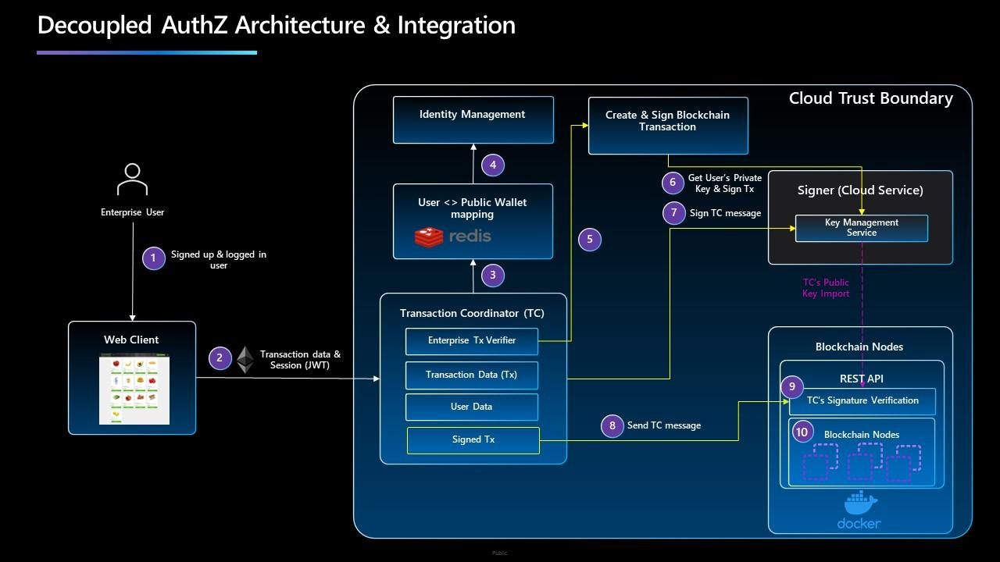
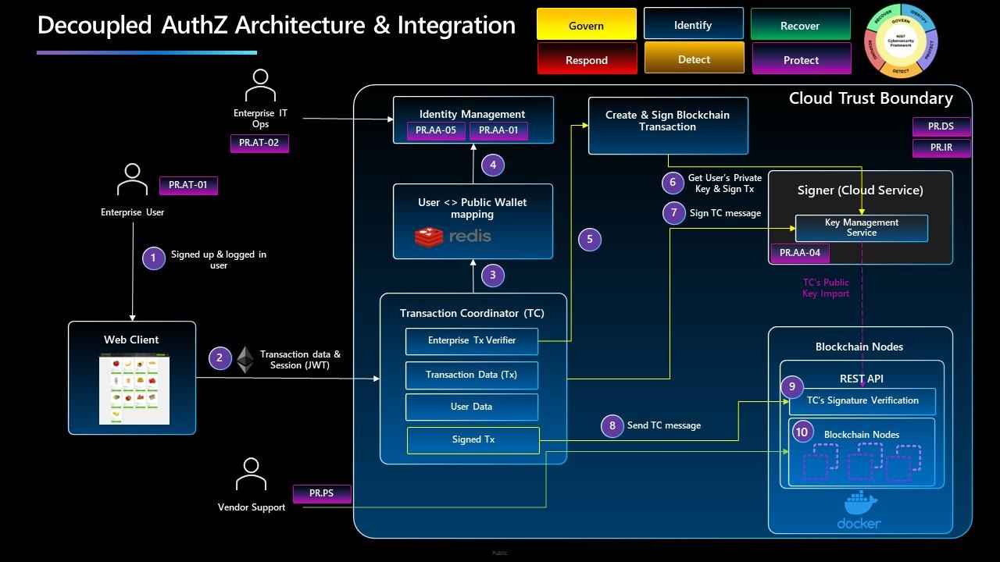

# Enterprise Integration

## System Security Architecture

The following high-level logical diagram represents a baseline architecture for system's security considerations. Each step in the diagram plays a critical role in ensuring the integrity and confidentiality of our data and systems. This image will serve as the foundation upon which we will elaborate on different views per NIST CSF 2.0 (see[ here](https://www.nist.gov/news-events/news/2024/02/nist-releases-version-20-landmark-cybersecurity-framework)).

Each step is meticulously designed to contribute to the overall security posture, encompassing various layers of defense and control. However, it is crucial to elaborate main data flow steps before explaining security controls and how system meets security requirements as per NIST CSF 2.0:

***

**Step 1**&#x20;

In this initial step, an enterprise user leverages the existing sign-in mechanisms, with Single Sign-On (SSO) support available if the enterprise Identity Management (IdM) system allows integration with external IdM providers. At this stage, the assumption is that the user is authenticated through conventional means, having a claims-based token that contains their username and role within the broader enterprise system. This authentication process forms the foundation for the user's access to the enterprise's systems and resources, ensuring secure and authorized entry.

***

**Step 2**

In this step, utilizing a Single Page Application (SPA), the user initiates transactions by sending crypto tokens to other users within the enterprise system. This process may involve integrating into the enterprise's internal directories of employees, empowering the web User Experience (UX) to enforce only allowed transactional activities among users within the enterprise. Through this approach, the system ensures that all transactions are conducted within the defined boundaries of authorization, promoting secure and controlled interactions while leveraging the organization's internal resources for seamless and compliant user transactions.


Even though the underlying system will use a blockchain (Blade), at this step, users do not possess either public or private keys. All the keys are stored within the cloud boundary, managed by the vendor for the enterprise as part of the service.


***

**Step 3**

During this stage, the process involves traversing a trust boundary, where the exposed service is the Transaction Coordinator. This coordinator is responsible for verifying the validity of user transactions and ensuring the creation of a proper blockchain transaction by utilizing the specific user's private key. By performing these verification and validation steps, the system maintains the integrity and security of the transactions, leveraging blockchain technology to secure and authenticate the transactional data. This ensures that all user transactions are authenticated and recorded accurately within the blockchain, enhancing the overall trust and transparency of the enterprise system.

Furthermore, it serves the purpose of scaling the cloud architecture by loosely coupling blockchain nodes with the enterprise authorization logic. This process is ensured through steps from 3 to 8. Starting with step 3, the Transaction Coordinator extracts the public key (e.g. the user’s wallet address) from an internal caching service which stores the map of user ids and their respective public key.

***

**Step 4**&#x20;

In this phase, with the user's identification for initiating a transaction and details of the recipient user, authorization procedures are implemented. These procedures involve validating whether the users have the authorization to engage in the transaction. This is achieved by cross-referencing with Identity and Access Management (IaM) systems to confirm the users' transaction privileges, as well as their active employment status within the enterprise. This step essentially serves as a verification check to ensure that the User Experience (UX) successfully enforced the transactional restrictions as established in step 2. By validating the authorization and user status, the system upholds compliance and security measures, reinforcing the integrity of the transactional processes within the enterprise system.

***

**Step 5**

&#x20;Upon completion of the thorough validation and verification checks in previous steps, and upon TC confirming that all necessary criteria are met, the TC proceeds to utilize the user's private key to generate an actual blockchain transaction.

***

**Step 6**

&#x20;By leveraging the user's private key, the TC ensures the secure and authenticated creation of the blockchain transaction, thereby preserving the integrity and confidentiality of the transactional data. To leverage a user's private key, the service needs to acquire the private key from the Key Management Service by leveraging the user's public key.

***

**Step 7**

In this scenario, to achieve architectural decoupling and establish independence of blockchain nodes from the enterprise's authorization layer, the Transaction Coordinator (TC) is required to sign its message related to the blockchain transaction intended for the blockchain's REST APIs. This signing process serves as a parallel step and involves importing the public key of the TC to the blockchain nodes. By doing so, the TC can sign the transaction message, enabling its secure transmission to the blockchain's REST APIs. This parallel step is crucial as it facilitates subsequent verification in step 9, ensuring the authenticity and integrity of the message thus ensuring blockchain nodes can trust the process happening within the cloud boundary but outside the blockchain native cryptographic process. By integrating the public key of the TC with the blockchain nodes, the enterprise reinforces the robustness and reliability of the blockchain transaction processes, thereby enhancing the overall security and transparency of the system. Most importantly, by relying on message integrity, the security of the system architecture is not reliant only on network security between blockchain nodes and the enterprise authorization process.

***

**Step 8**

Transaction Coordinator (TC) uses a prepared blockchain transaction, signs it with its private key, and then invokes a REST API to submit the transaction.

***

**Step 9**

The REST API verifies the authenticity of the message by checking the signature to ensure it indeed comes from the transaction coordinator (TC). This verification is possible because the public key was imported in a parallel process, as described in step 7, allowing the API to validate the source of the message.

***

**Step 10**

This step marks the culmination of the transaction process, as the validated transaction details by blockchain nodes are leveraging inherent secure design and cryptography of blockchain networks, establishing an immutable record of the transaction. This process enhances the trustworthiness and transparency of the transactional activities within the enterprise ecosystem.

In NIST CSF 2.0, there are six functions encompassing requirement specifications, which will be described in subsequent chapters. Notably, the "Protect" function holds the most applicable requirements for the view of the architecture we are examining. This focus on protection aligns with our emphasis on fortifying our security posture and safeguarding our systems and data.

## NIST CSF 2.0 Protect Function 

The following diagram depicts the visual mapping of NIST CSF 2.0 protect category security controls and illustrates their placement within the overall architecture diagram.

The table below provides the details for each security control category, serving as an explanation on how the system is already compliant with the specific requirements where applicable and outlines a reminder for an enterprise responsible for operating a presented cloud environment on achieving compliance with specific process level requirements. For reference,[ here](https://doi.org/10.6028/NIST.CSWP.29) is the exact version of the NIST CSF 2.0 framework analyzed.

<table data-header-hidden><thead><tr><th width="117"></th><th width="198"></th><th></th></tr></thead><tbody><tr><td><strong>Identifier</strong></td><td><strong>Category</strong></td><td></td></tr><tr><td><strong>PR.AA</strong></td><td>Identity Management, Authentication and Access Control</td><td>By leveraging a cloud identity management system, the overall solution enables the enterprise to maintain compliance with all PR category requirements. Specifically, PR.AA-01, PR.AA-02, and PR.AA-05 relate to processes, while PR.AA-03 and PR.AA-04 are directly supported by the system through safeguarding identity assertions with the OAuth protocol and implementing complete mediation to ensure services authenticate at each step. As described in the overall Security Architecture chapter, additional controls have been added to ensure message integrity between blockchain nodes and system services. Furthermore, PR.AA-06, which concerns physical controls, is supported by the multiple certifications of the chosen cloud vendor.</td></tr><tr><td><strong>PR.AT</strong></td><td>Awareness and Training</td><td>During the handover process from blockchain product setup to enterprise IT operations, the specialized training on securely configuring the overall system is offered while keeping the focus on sensitive data and data lifecycle management. It's also expected that the enterprise already has standard cybersecurity and privacy awareness training in place within their cybersecurity program, shown as PR.AT-01 control at Enterprise User.</td></tr><tr><td><strong>PR.DS</strong></td><td>Data Security</td><td>The comprehensive description of PR.DS in the Risk Based methodology section explains how compliance with the requirements on the data at rest, data in use and data in transit have been integral parts of the design. Moreover, regarding PR.DS-11, the product vendor provides explicit procedures for maintaining and updating the system including backup and restore processes, where the data may remain within the cloud context as well.</td></tr><tr><td><strong>PR.PS</strong></td><td>Platform Security</td><td>
As depicted in the diagram, PR.PS heavily relies on supplier practices and design, requiring a thorough description of all subcategories of the requirements. Firstly, PR.PS-01 through PR.PS-02 are comprehensively addressed, providing clear procedures for maintaining and updating the system, outlining secure provisioning of new updates, rollback processes, as well as backup and restore processes. Additionally, the product is versioned, and all software changes are disclosed through release notes. Adherence to industry best practices, such as rigorous testing of changes in a test environment before deployment to production, is strongly encouraged.

Secondly, PR.PS-03 is entirely covered by the cloud vendor. Moreover, for PR.PS-04, as the blockchain nodes were developed as a cloud-native system, the control relies on storing logs within the cloud vendor's log analytics services, enabling continuous monitoring and integration with SIEM tools if required for SOC purposes.

Regarding PR.PS-05, the enterprise asset owner should implement such a process with the following considerations in mind: the change management process needs to maintain an up-to-date list of authorized software, promptly removing any unauthorized software found on the system. Furthermore, the network security configuration will encompass hardening measures to allow only essential ports, specifically those required for peer-to-peer communication. Finally, as per PR.PS-06, the blockchain nodes product has been implemented in accordance with NIST SP 800-218, the SSDF framework for Secure Software Development.
</td></tr><tr><td><strong>PR.IR</strong></td><td>Technology Infrastructure Resilience</td><td>To align the infrastructure resilience category with the organization’s risk strategy of safeguarding asset confidentiality, integrity, availability, and organizational resilience, the overall system strategically utilizes leading cloud vendor providers to offer an easier integration of the operations function with the existing processes and policies of the enterprise. The system is designed to leverage cloud security controls recommended by vendors, and avoid the custom controls by design as they would require additional awareness and trainings for the operations teams. For instance, PR.IR-04 is easily maintained through the horizontal scalability of the blockchain nodes farm.</td></tr></tbody></table>

## Key Takeaways

This section emphasizes the system security and importance of confidentiality within Blade, particularly in cloud execution environments. The discussion highlights key considerations for ensuring data protection within the Blade framework:

1. Secure Communication with TLS encryption:
   1. Between Nodes: the underlying protocol is gRPC.
   2. Between Blockchain Users and Nodes: the underlying protocol is HTTP(S)
2. Secure Node Data: Implement encryption for data at rest to safeguard blockchain node data stored on disk. Utilize encryption with KMS keys or compatible file-system-level encryption or database encryption solutions.
3. Secure Node Private Keys: Utilize Key Management Services (KMS) to securely store and manage private keys. KMS solutions offer hardware security modules (HSMs) for cryptographic storage, ensuring that keys remain protected against unauthorized access.
4. Mitigations to information disclosure threats, and in case of sensitive applications, **clearly recommends** confidential computing for data in use encryption to complement data at rest encryption, while TLS 1.2+ is recommended for data in transit encryption.
5. The document delves into the details of system security architecture and the seamless integration of Blade into a cloud environment tailored for an enterprise company, aligning with the guidelines set forth by the **NIST Cybersecurity Framework (CSF) 2.0**.
